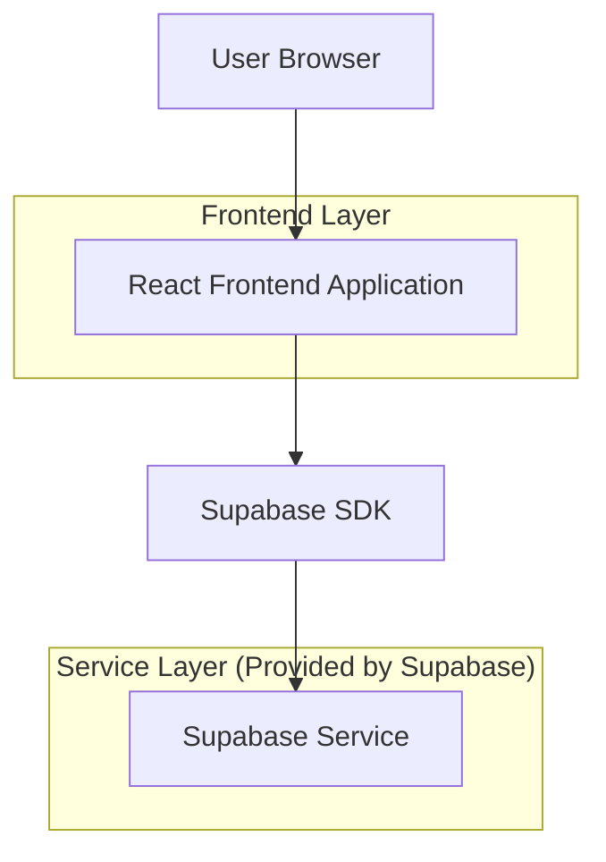
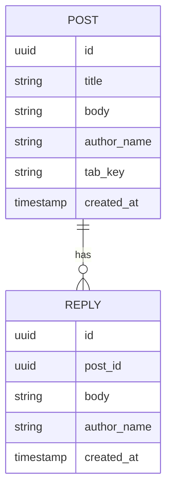

## 1.Architecture design


## 2.Technology Description
- Frontend: React@18 + vite + tailwindcss@3
- Backend: Supabase (Auth opcional) + Supabase Database (PostgreSQL)

## 3.Route definitions
| Route | Purpose |
|-------|---------|
| /dashboard | Dashboard com visão geral e atalhos para Comunidade |
| /comunidade | Lista de posts com abas e filtros |
| /posts/:postId | Detalhe do post com respostas e envio de resposta |

## 6.Data model(if applicable)

### 6.1 Data model definition


### 6.2 Data Definition Language
Post Table (posts)
```
CREATE TABLE posts (
  id UUID PRIMARY KEY DEFAULT gen_random_uuid(),
  title TEXT NOT NULL,
  body TEXT NOT NULL,
  author_name TEXT NOT NULL,
  tab_key TEXT NOT NULL DEFAULT 'recentes',
  created_at TIMESTAMPTZ NOT NULL DEFAULT NOW()
);

CREATE INDEX idx_posts_created_at ON posts(created_at DESC);
CREATE INDEX idx_posts_tab_key ON posts(tab_key);
```

Reply Table (replies)
```
CREATE TABLE replies (
  id UUID PRIMARY KEY DEFAULT gen_random_uuid(),
  post_id UUID NOT NULL,
  body TEXT NOT NULL,
  author_name TEXT NOT NULL,
  created_at TIMESTAMPTZ NOT NULL DEFAULT NOW()
);

CREATE INDEX idx_replies_post_id_created_at ON replies(post_id, created_at ASC);
```

RLS (recomendação mínima)
```
ALTER TABLE posts ENABLE ROW LEVEL SECURITY;
ALTER TABLE replies ENABLE ROW LEVEL SECURITY;

-- leitura pública
GRANT SELECT ON posts TO anon;
GRANT SELECT ON replies TO anon;

-- escrita para usuários autenticados (se Auth for habilitado)
GRANT ALL PRIVILEGES ON posts TO authenticated;
GRANT ALL PRIVILEGES ON replies TO authenticated;
```
