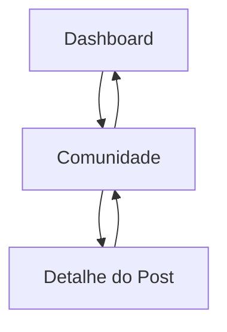

## 1. Product Overview
Uma experiência de comunidade com leitura e participação em posts.
Você navega pelo feed (com abas/filtros), abre um post e responde; o Dashboard serve como ponto de entrada.

## 2. Core Features

### 2.1 Feature Module
Os requisitos do produto consistem nas seguintes páginas principais:
1. **Dashboard**: visão geral e atalhos para a Comunidade.
2. **Comunidade**: lista de posts com abas e filtros.
3. **Detalhe do Post**: conteúdo do post, respostas e envio de resposta.

### 2.2 Page Details
| Page Name | Module Name | Feature description |
|-----------|-------------|---------------------|
| Dashboard | Cabeçalho e navegação | Exibir título da área e acesso direto para a página Comunidade. |
| Dashboard | Visão geral | Exibir um resumo simples com cards/itens de destaque (ex.: últimos posts/atividade recente) e permitir abrir um item para ir ao detalhe. |
| Comunidade | Cabeçalho e navegação | Exibir título da Comunidade e acesso ao Dashboard. |
| Comunidade | Abas | Alternar a visualização do feed por abas (ex.: Recentes / Em alta / Seguindo) atualizando a lista. |
| Comunidade | Filtros e busca | Filtrar a lista de posts por critérios disponíveis (ex.: palavra-chave e ordenação) sem sair da página. |
| Comunidade | Lista de posts | Exibir posts em formato de cards/linhas com informações essenciais e permitir abrir o Detalhe do Post. |
| Detalhe do Post | Conteúdo do post | Exibir título, autor e corpo do post. |
| Detalhe do Post | Lista de respostas | Exibir respostas em ordem consistente (ex.: mais antigas primeiro) com identificação básica do autor e data/hora. |
| Detalhe do Post | Enviar resposta | Permitir digitar e enviar uma nova resposta e, após sucesso, atualizar a lista. |

## 3. Core Process
**Fluxo principal (usuário):**
1. Você entra no **Dashboard** e seleciona ir para a **Comunidade** (atalho/menu).
2. Na **Comunidade**, você alterna **abas** e aplica **filtros/busca** para encontrar um post.
3. Você abre um item da lista para acessar o **Detalhe do Post**.
4. No **Detalhe do Post**, você lê as respostas existentes e **envia uma resposta**.
5. Você retorna para a **Comunidade** ou **Dashboard** pela navegação.

